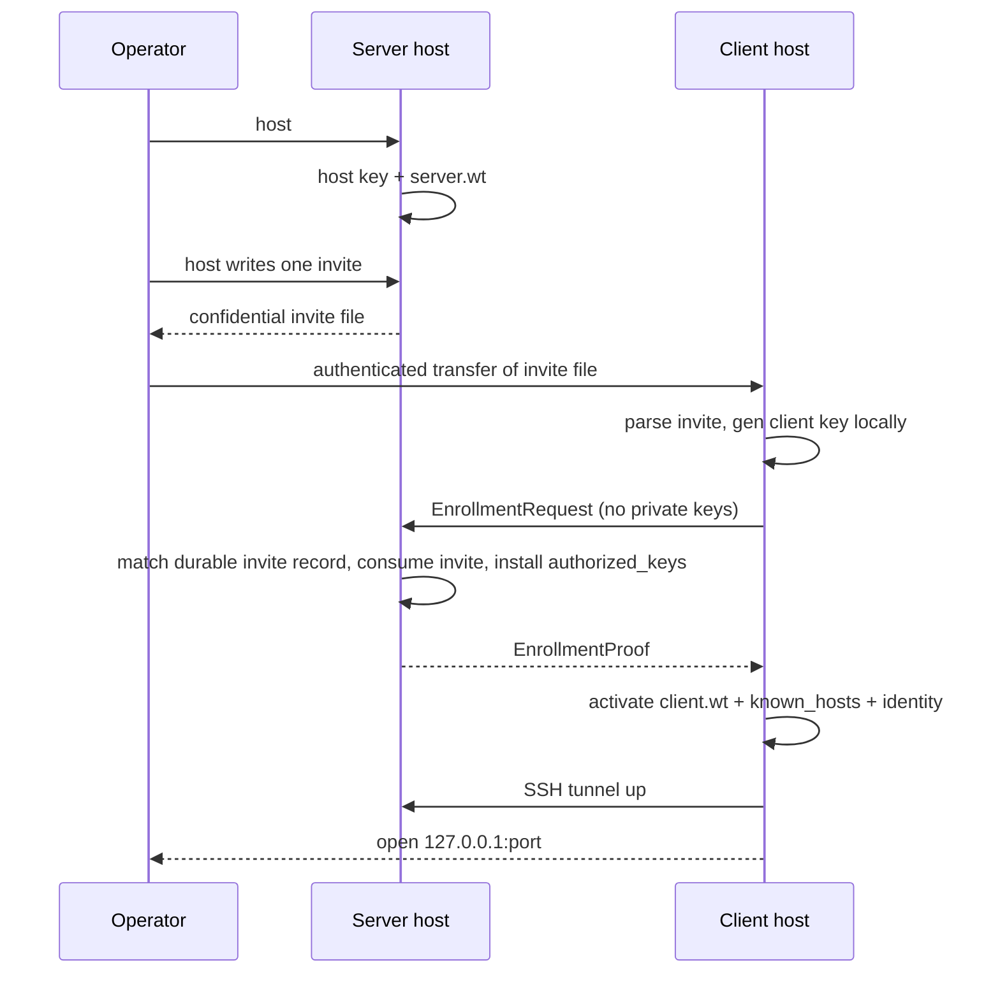
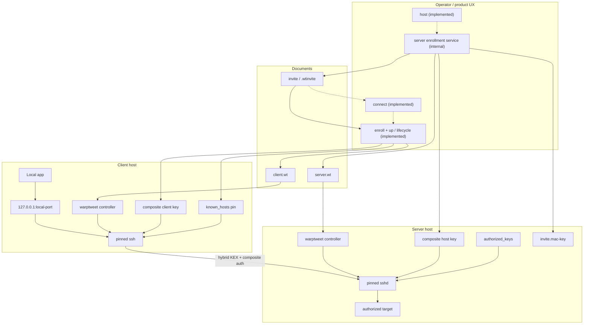

# Reviewer catch-up: CLI, invites, manifests, architecture

Status: working-tree summary for design review, 2026-08-14  
Version string in tree: `0.1.0-dev`  
Module: `warptweet.com/warptweet`

This note is a single briefing for reviewers who need the current product shape, the designed two-verb CLI, invite files, `.wt` manifests, and how that maps to what is actually implemented today. Prefer this over reading every historical doc first; deep links sit at the end.

**One-line positioning:** WarpTweet is a fail-closed, dual-endpoint-managed TCP local-forward product. A Go controller wraps a pinned OpenSSH 10.4p1 data plane (static OpenSSL 3.5.7) under hybrid ML-KEM/X25519 KEX and composite ML-DSA/Ed25519 authentication, driven by strict `.wt` policy manifests and invites that contain public data but are confidential, single-use capabilities until consumed or expired. The product UX is two verbs (`host` / `connect`); operator verbs (`server` / `enroll` / `up` / `run` and lifecycle) remain for bootstrap and advanced use. Both surfaces are implemented in `command.Run`.

This is **not** a supported end-to-end public release. Website and packaging gates teach `connect`; dual-host package interop evidence remains incomplete.

---

## 1. What the product is (and is not)

### Is

```text
App → 127.0.0.1:<local-port>
    → WarpTweet client (controller + pinned OpenSSH ssh)
    → SSH transport (hybrid KEX + composite auth, no classical fallback)
    → WarpTweet server (pinned sshd + destination ACL)
    → <authorized-ip>:<authorized-port>
```

Managed-endpoint **TCP local-forward only**. Both ends, engines, identities, and the single authorized destination are treated as one deployment.

### Is not

- General SSH client, VPN, mesh, or zero-trust broker
- Shells, SFTP, SOCKS, remote forward, agent forward, X11, TUN
- Wildcard listeners, DNS target names, passwords, or TOFU
- Classical crypto fallback when a peer cannot do the profile
- A secret store: `.wt` and invites never carry private keys

### Crypto profile (immutable Profile v1)

| Field | Value |
| --- | --- |
| Profile ID | `warptweet-tcp1-openssh10.4p1-openssl3.5.7-mlkem768x25519-mldsa44-ed25519` |
| Engine | OpenSSH 10.4p1 |
| OpenSSL | 3.5.7, static linkage |
| KEX | `mlkem768x25519-sha256` |
| Host + client auth key | `ssh-mldsa44-ed25519@openssh.com` |
| Ciphers | `chacha20-poly1305@openssh.com`, then `aes256-gcm@openssh.com` |
| Binding status | `openssh-vendor-qualified` (not IETF-standardized) |
| Fallback | **None** (classical-only peer = hard fail) |

Language rules for external copy: do not brand WarpTweet itself as experimental; that word applies only to OpenSSH’s description of its vendor-qualified authentication binding. Do not market that binding as standardized, quantum-proof, or FIPS validated.

Platform **artifact** profiles are separate from the wire profile: `linux-amd64`, `linux-arm64`, `darwin-arm64`, `darwin-amd64`.

---

## 2. Document model: three public JSON kinds

Reviewers should keep these three kinds distinct.

| Kind | Typical name | Role | Secrets? |
| --- | --- | --- | --- |
| `warptweet.client-tunnels` | `client.wt` | Client policy: server endpoint, tunnels, supervision, ssh digest pin | No |
| `warptweet.server-gateway` | `server.wt` | Server policy: listen, target, account, fixed key paths, sshd/bundle pins | No |
| `warptweet.invite` | `*.wtinvite` (JSON document) | Single-use enrollment authorization | Confidential bearer; transfer authenticated and delete after use |

Media type for tunnel manifests: `application/vnd.warptweet.tunnel+json`.  
Load path requires the **`.wt` extension**.  
AGENTS.md rule: treat `.wt` as a versioned WarpTweet manifest, **never** as a private-key container.

Strict decode everywhere that matters: UTF-8, single object, no unknown or duplicate fields, no trailing values, size bounds, exact `profile_id` match.

---

## 3. `.wt` manifests

### Client (`warptweet.client-tunnels`, schema v1)

Example: `examples/client.example.wt`

```json
{
  "kind": "warptweet.client-tunnels",
  "schema_version": 1,
  "profile_id": "warptweet-tcp1-openssh10.4p1-openssl3.5.7-mlkem768x25519-mldsa44-ed25519",
  "ssh_binary_sha256": "<64 lowercase hex>",
  "server": { "address": "192.0.2.10", "port": 2222, "user": "warptweet" },
  "tunnels": [{
    "id": "database-primary",
    "listen": { "address": "127.0.0.1", "port": 15432 },
    "target": { "address": "198.51.100.20", "port": 5432 }
  }],
  "supervision": { "initial_backoff": "1s", "max_backoff": "30s" }
}
```

Identity path, known_hosts, and engine binary path are **install invariants**, not free-form fields in the manifest (production Linux client layout under `/etc/warptweet/` and `/opt/warptweet/`).

### Server (`warptweet.server-gateway`, schema v1)

Example: `examples/server.example.wt`

```json
{
  "kind": "warptweet.server-gateway",
  "schema_version": 1,
  "profile_id": "warptweet-tcp1-openssh10.4p1-openssl3.5.7-mlkem768x25519-mldsa44-ed25519",
  "sshd_binary_sha256": "<64 hex>",
  "openssh_bundle_manifest_sha256": "<64 hex>",
  "listen": { "address": "192.0.2.10", "port": 2222 },
  "target": { "address": "198.51.100.20", "port": 5432 },
  "dedicated_user": "warptweet",
  "host_key_path": "/opt/warptweet/etc/ssh_host_mldsa44_ed25519_key",
  "authorized_keys_path": "/opt/warptweet/etc/authorized_keys/warptweet"
}
```

`host_key_path` is a **fixed path reference**. Key material is never embedded. Schema const-locks the production host key path.

### Operational note

Not secret containers, but topology, digests, and policy are sensitive: authenticated distribution, restrictive perms, atomic activation, audit by digest/generation.

Schemas: `schemas/client-tunnels-v1.schema.json`, `schemas/server-gateway-v1.schema.json`.

---

## 4. Invite files

### Purpose

Single-use, short-lived, **confidential bearer** enrollment authorizations.  
Kind: `warptweet.invite`, `schema_version: 2`.  
Not a tunnel manifest. Not reusable after consume. Never private keys or passwords. Transfer over an authenticated channel and delete after consumption or expiry.

### Canonical fields (from `internal/enrollment`)

```json
{
  "kind": "warptweet.invite",
  "schema_version": 1,
  "invite_id": "<32 hex>",
  "client_name": "laptop-1",
  "server_address": "192.0.2.10",
  "server_port": 2222,
  "enroll_port": 29722,
  "target_address": "198.51.100.20",
  "target_port": 5432,
  "principal": "warptweet",
  "profile_id": "warptweet-tcp1-openssh10.4p1-openssl3.5.7-mlkem768x25519-mldsa44-ed25519",
  "artifact_profile_id": "linux-amd64",
  "host_public_key": "ssh-mldsa44-ed25519@openssh.com AAAA... comment",
  "issued_at": "2026-08-12T12:00:00.000000000Z",
  "expires_at": "2026-08-12T12:15:00.000000000Z",
  "nonce": "<32 hex>",
  "mac": "<base64url HMAC-SHA256>"
}
```

| Property | Rule |
| --- | --- |
| Default TTL | 15 minutes (hard max) |
| Size bound | 16 KiB |
| MAC | HMAC-SHA256 over newline-joined fields (excludes `mac`) |
| MAC secret | 32 bytes, server-local only (`/etc/warptweet/invite.mac-key`, mode 0600) |
| Server durable state | `/var/lib/warptweet/invites/<invite_id>.json` with `issued` / `consumed` / `revoked` / `expired` |
| Client MAC verify | Client **does not** hold the MAC key; it fails closed on shape, expiry, profile, and secret markers. Authenticity of accept is proven later by enrollment proof binding + host key pin. |

### Invite file mint (implemented)

| | Public path (`host`) | Internal enrollment service |
| --- | --- | --- |
| Default name | `<sanitized-label>.wtinvite` (hostname or `--name`) | stdout JSON (optional durable store under invites dir) |
| Extension | `.wtinvite` (type); basename is human who/what | N/A for stdout |
| Write mode | `0600`, `O_EXCL`, CWD default | durable record `0600` under `/var/lib/warptweet/invites/` |
| Collision | try `label.wtinvite`, then `label-<invite_id4>.wtinvite`; `--out` exact path must end in `.wtinvite` and fail on collision | N/A |
| Overrides | `--name`, `--out`, `--stdout`, `--no-invite` | `--name`, `--target` |

Examples: `db-1.wtinvite`, `studio-mac.wtinvite`, `curtis-macbook.wtinvite`, collision form `studio-mac-a81f.wtinvite`.  
Type lives in the extension; do not prefix `wt-invite-` (redundant with `.wtinvite`). No timestamps in filenames.

### Create / consume (intended sequence)



**Private keys are always generated on the machine that will hold them.** Host never mints a client private key. Connect never mints a host private key.

Enrollment request / proof (shapes):

```json
// EnrollmentRequest (client → host)
{
  "invite_id": "...", "nonce": "...", "client_name": "...",
  "public_key": "...", "profile_id": "...",
  "tunnel_id": "...", "listen_address": "127.0.0.1", "listen_port": 15432
}

// EnrollmentProof (host → client)
{
  "invite_id": "...", "client_id": "...",
  "host_public_key": "...", "public_key": "...",
  "target": "198.51.100.20:5432", "principal": "warptweet",
  "profile_id": "...", "nonce": "...", "accepted_at": "..."
}
```

### Enrollment accept (packaged 2026-08-14)

| Piece | Role |
| --- | --- |
| `warptweet server enroll-listen` | Pinned TLS 1.3 `POST /v1/enroll`, `/v1/revoke`, `/v1/rotate` on port **29722** |
| `warptweet host` | Requires both the SSH and pinned-TLS enrollment listeners before Ready |
| `warptweet server accept-enrollment --request` | One-shot offline accept for air-gapped ops |
| `enrollment.Accept` | Validate request, journal pending state, reconcile authorization, consume invite, return a non-secret proof |
| Client `enroll` / `connect` | Generate the management capability locally, auto-submit unless offline, and store the local receipt |
| Client `rotate` / `revoke` | Present management token over the management interface; host acks before local completion |

Invite possession is the single-use enrollment authorization. A client-generated
management capability, stored only as a server-side digest, authorizes later
rotate/revoke. Every control request uses TLS 1.3 with hybrid
`X25519MLKEM768` key agreement and the exact Ed25519 SPKI pinned by the invite.
Dual-host package interop evidence remains WP8.

---

## 5. CLI: product path and operator path

### Product verbs (in `command.Run`; website + docs)

```text
warptweet host --to <port|ip:port> [--name <label>] [--out path] [--stdout] [--listen ip:port] [--no-invite] [--json]
warptweet connect <invite.wtinvite> [--yes] [--proof <proof.json>] [--once]
```

| Verb | Machine | Meaning |
| --- | --- | --- |
| `host` | Host that can reach the service | Ensure host identity, write server policy, start host, mint one invite file |
| `connect` | Laptop / client | Consume invite, create client identity, pin host, activate route, bring tunnel up |

Composition map:

- `host` → ensure host identity + server manifest + service + invite mint
- `connect` → enroll + activate + up  

Source of truth for this UX: `docs/2026-08-12_cli-host-connect.md`.
Website (`src/components/CLIShowcase.astro`) and `packaging/evidence/public-release.json` already surface `warptweet connect <invite-file>`.

### Implemented CLI (actual help / `internal/command`)

Entry: `cmd/warptweet/main.go` → `internal/command.Run` (Go `flag`, no subcommand framework). Separate helper: `cmd/warptweet-provisioner`, whose `serve` mode exposes the typed macOS activation and lifecycle boundary.

```text
# Product path
warptweet host --to <port|ip:port> [--name <label>] [--out path] [--stdout] [--listen ip:port] [--no-invite] [--json]
warptweet connect <invite.wtinvite> [--yes] [--proof <proof.json>] [--once]

# Diagnostics / policy
warptweet profile
warptweet validate --config <manifest.wt>
warptweet render-client --config <client.wt> --tunnel <id>
warptweet render-server --config <server.wt>
warptweet render-authorized-key --config <server.wt> --public-key <client.pub>
warptweet render-known-host --config <client.wt> --tunnel <id> --public-key <host.pub>
warptweet doctor --config <client.wt> --tunnel <id>
warptweet doctor-server --config <server.wt>

# Low-level supervised launch
warptweet run --config <client.wt> --tunnel <id> [--once]

# Internal host service + lifecycle
warptweet server enroll-listen [--listen ip:port]
warptweet server accept-enrollment --request <request.json>
warptweet server revoke <client-or-invite-id>
warptweet server status
warptweet enroll <invite.wtinvite> [--yes] [--prepare-only] [--proof <proof.json>]
warptweet up <tunnel-id> [--once]
warptweet status [<tunnel-id>] [--json]
warptweet down <tunnel-id>
warptweet rotate <tunnel-id>
warptweet revoke <tunnel-id>
warptweet uninstall --preserve-identity
warptweet version
```

| Layer | Surface | Role | State |
| --- | --- | --- | --- |
| Product path | `host`, `connect` | Two-command UX | **Implemented** (2026-08-14) |
| Operator path | `server *`, `enroll`, `up`/`down`/`status` | Bootstrap, mint, lifecycle | Implemented |
| Enrollment accept | `server enroll-listen`, `warptweet-enroll.service`, `accept-enrollment` | Consume invite, install authorized_keys, return proof + management token | **Implemented**; HTTP on `enroll_port` (default 29722) |
| Client manage | `rotate`, `revoke` | Server-acked key rotate / auth clear via management token | **Implemented** (2026-08-14) |
| Diagnostics | `profile`, `validate`, `render-*`, `doctor*` | Policy without network | Implemented |
| Low-level run | `run --config … --tunnel …` | Supervised OpenSSH | Implemented |
| Advanced gen | `gen host`, `gen client` | Explicit identity gen | Designed only (keygen embedded in init/enroll/rotate) |

### Concrete examples (today)

```sh
make build
./bin/warptweet profile

# Server host: warptweet host starts and validates both listeners once bootstrap artifacts exist
warptweet host --to 5432 --listen 192.0.2.10:2222 --name laptop-1
# writes laptop-1.wtinvite after both listeners are ready

# Client host
warptweet connect laptop-1.wtinvite --yes
warptweet status laptop-1 --json
warptweet rotate laptop-1
warptweet revoke laptop-1
```

---

## 6. Architecture and trust

### Component map

| Component | Package(s) | Responsibility |
| --- | --- | --- |
| CLI boundary | `internal/command` | Commands, flags, orchestration |
| Client manifest | `internal/config` | Strict `.wt` client load/validate |
| Server manifest + render | `internal/server` | Host `.wt`, sshd config, authorized_keys |
| Wire crypto profile | `internal/profile` | Immutable Profile v1 |
| Platform artifact profile | `internal/artifactprofile`, `internal/platform/*` | Layout/format/signing by GOOS/GOARCH |
| Engine preflight/launch | `internal/engine` | Binary attest, assets, effective config, readiness |
| Supervisor | `internal/supervisor` | Restart backoff around one tunnel process |
| Enrollment | `internal/enrollment` | Invite create/verify/store/consume; client parse |
| Lifecycle state | `internal/lifecycle` | Per-tunnel phase/pid/lock under runtime root |
| Known hosts | `internal/knownhosts` | Managed host pins |
| SSH wire checks | `internal/sshwire` | Composite public-key blob validation |
| Strict JSON | `internal/strictjson` | Duplicate key rejection |
| Install paths | `internal/installlayout` | Fixed Linux + Darwin paths |
| Release gates | `internal/publicrelease`, `internal/releaseevidence` | CTA / interop evidence |

### System diagram



### Trust model (condensed)

- Network adversary: passive harvest + active MITM; mitigated by hybrid KEX, pinned composite host key, no fallback
- Loopback listener is a **host boundary**, not per-process authz for other local users/processes
- Target service is outside tunnel confidentiality after SSH termination on the server host
- `.wt` is untrusted until strict validation; never secret-bearing
- Invite MAC authenticity is **server-side**; client trusts the operator transfer channel plus post-enroll proof binding
- Supply chain: fixed root-owned paths, SHA-256 pins, static OpenSSL, exact version strings, re-attest every launch

### Client launch / readiness (high level)

1. Load production client `.wt` (or `--config` for diagnostics)
2. Select one tunnel by id
3. Preflight: ownership, digests, binary format + static OpenSSL, version line, algorithms, trust files, closed argv (`ssh -F none`, env only `LANG=C` `LC_ALL=C`)
4. Launch ControlMaster with one local forward
5. Readiness witness: control-socket → `ssh -O check` PID match → descriptor-relative unlink of mux path → child still alive → **Ready**
6. Ready means auth + local listener created; **not** target health (`target_health: not_checked`)

### Fixed filesystem (Linux production sketch)

```text
/opt/warptweet/bin/warptweet
/opt/warptweet/libexec/openssh/{bin/ssh,bin/ssh-keygen,sbin/sshd,...}
/opt/warptweet/etc/sshd_config
/opt/warptweet/etc/ssh_host_mldsa44_ed25519_key
/opt/warptweet/etc/authorized_keys/<user>
/opt/warptweet/share/openssh-bundle.sha256
/etc/warptweet/{client.wt,server.wt,invite.mac-key,identity/,trust/,enrollment/}
/var/lib/warptweet/{invites/,clients/,server/}
/run/warptweet/tunnels/<tunnel-id>/{state.json,lock,pid}
```

Canonical fixed paths are defined in `internal/installlayout` (engine, manifests, identity, trust, authorized_keys). Durable invite/client/server state lives under `/var/lib/warptweet/` as used by `internal/command` (not relocated into `installlayout` constants).

Darwin client uses Application Support / Caches layout and service user `_warptweet`. Client-only package (no sshd in Darwin layout). See packaging docs for Homebrew/cask path.

---

## 7. Design decisions since early August (docs trail)

| Doc | Decision |
| --- | --- |
| `2026-08-09_architecture.md` | Managed local-forward MVP; wire vs artifact profiles; `.wt` family; fail-closed invariants |
| `2026-08-09_crypto-profile.md` | Single immutable PQ hybrid profile; no classical fallback; vendor-qualified auth language |
| `2026-08-09_threat-model.md` | Assets, adversaries, readiness spoofing, secret-smuggling via `.wt` |
| `2026-08-10_*` layout/readiness/server-gate/static-openssl | Fixed paths, PID-bound readiness, doctor gates |
| `2026-08-12_cli-host-connect.md` | **Primary UX**: `host`/`connect`; invite basename human, type in `.wtinvite`; demote `server`/`enroll` |
| `2026-08-12_client-lifecycle.md` | enroll/up/down/status/rotate/revoke; management-token flows |
| `2026-08-12_linux-server-packages.md` | deb/rpm layout, invite dirs, server admin CLI |
| `2026-08-12_homebrew-delivery.md` | macOS client delivery and package gates |
| `2026-08-12_public-release-path.md` | Homebrew CTA dark until package-interop evidence; next command evolving to `connect` |
| `2026-08-12_package-interop-evidence.md` | WP8 checklist including invite single-use + fail-closed cases |

---

## 8. Gaps and review hotspots

Use these as discussion prompts; they are intentional incomplete areas or drift, not silent bugs alone.

1. **Product CLI path implemented** (`host`/`connect`, `.wtinvite`, enroll accept, rotate/revoke). Operator verbs remain for advanced use.
2. **Enrollment/management is invite-pinned HTTPS** — exact TLS 1.3, hybrid `X25519MLKEM768`, `http/1.1`, and the invite-pinned Ed25519 SPKI. Air-gapped `--proof` remains available. Invites carry the MAC-bound SPKI and `enroll_port` (default 29722).
3. **Server durable invites/clients** under `/var/lib/warptweet/{invites,clients,server}/` are internal state, distinct from operator-facing `.wtinvite` files and from `installlayout` engine/manifest paths.
4. **`gen host` / `gen client`** designed as advanced verbs; keygen is embedded in `host` / `enroll` / `rotate` instead.
5. **No supported e2e release** — two-endpoint interop, negotiated-algorithm observation, rekey, and confinement evidence still pending in the gate checklist (WP8). Local control-plane confidence: `scripts/test-enrollment-control-plane.sh`. Phase A dual-host spine: `scripts/interop/orchestrate.sh` (pinned packages + echo payload; remaining cases `not_run`).
6. **Packaged enroll unit** — `warptweet-enroll.service` is enabled on install and started by `host` after bootstrap artifacts exist; certificate renewal preserves the pinned key.
7. **macOS** packaging and attestation path in progress; production client gate history is Linux/static-OpenSSL heavy.
8. **Host manifest digests** refuse zero placeholders when required SSHD/bundle files are missing (recover only from an existing non-placeholder manifest).
9. **macOS privilege boundary** — package installation starts a typed root provisioner on a `root:admin` mode-0660 socket. It activates protected state and owns per-tunnel LaunchDaemons running as `_warptweet`; normal client commands require no repeated elevation.
10. **Public next action** is `warptweet connect <invite-file>`; operator `enroll` remains for advanced/offline flows.

---

## 9. Key paths for a deep dive

### Docs / product

- `README.md`, `AGENTS.md`, `SECURITY.md`
- `docs/2026-08-09_architecture.md`
- `docs/2026-08-09_crypto-profile.md`
- `docs/2026-08-09_threat-model.md`
- `docs/2026-08-12_cli-host-connect.md`
- `docs/2026-08-12_client-lifecycle.md`
- `docs/2026-08-12_linux-server-packages.md`
- `docs/2026-08-12_public-release-path.md`

### Schemas / examples

- `schemas/client-tunnels-v1.schema.json`
- `schemas/server-gateway-v1.schema.json`
- `examples/client.example.wt`
- `examples/server.example.wt`

### Implementation

- `cmd/warptweet/main.go`
- `internal/command/command.go`
- `internal/command/server_admin.go`
- `internal/command/lifecycle.go`
- `internal/enrollment/invite.go`
- `internal/enrollment/client.go`
- `internal/config/config.go`
- `internal/server/manifest.go`
- `internal/profile/profile.go`
- `internal/engine/` (preflight, launch, readiness)
- `internal/installlayout/`
- `packaging/evidence/public-release.json`
- `src/components/CLIShowcase.astro`

---

## 10. Suggested review agenda (30–45 min)

1. **Boundary check** — local-forward-only product vs feature pressure (shells, multi-target, classical fallback).
2. **Document model** — confirm `.wt` vs invite vs private key paths stay cleanly separated.
3. **CLI dual surface** — product `host`/`connect` vs operator verbs; packaging/website already teach `connect`.
4. **Invite trust** — operator transfer channel, MAC server-side only, single-use store, TTL, management-interface restrictions, offline proof.
5. **Crypto language** — vendor-qualified binding wording; no quantum-proof / FIPS / standardized claims.
6. **Release bar** — what still blocks “supported e2e” (enrollment endpoint, dual-host invite, algorithm observation, package evidence).

---

## Related docs (read next if needed)

- Architecture deep dive: `docs/2026-08-09_architecture.md`
- CLI product design: `docs/2026-08-12_cli-host-connect.md`
- Client lifecycle: `docs/2026-08-12_client-lifecycle.md`
- Threat model: `docs/2026-08-09_threat-model.md`
- Crypto profile: `docs/2026-08-09_crypto-profile.md`
